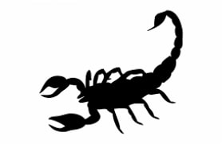

**Hey there, this writeup summarises my approach and flags obtained in the Target CTF Tier 1 challenge.**

# Cryptography/ Steganography Challenges

## Challenge 1: Beware the Ides of March

The following ciphertext was to be decrypted:

`GUR GNETRG UNF ORRA NPDHVERQ`

First instinct was to check for ROT 13 cipher on cyber chef. 

**Flag obtained was `THE TARGET HAS BEEN ACQUIRED`**

## Challenge 2: Now you see me, now you don't

The challenge had this intro and an image attached, as follows:

```markdown
You have intercepted a email sent between Bob and Alice, who we believe to be members of Shiny Scorpion. See a transcription of the message below:
Hi Bob,
Our good friend Vigenère is looking to follow up on the financial reports you're working on. Can you give me a timeline on when you think they would be ready to share out?
Best, Alice
There doesn't look to be anything malicious in the email, but the embedded photo in the email hit the automated threat detection. Can you find the true message of the email?
```


The mail had a clue, stating friend "vigenere" which made me think this cipher will definitely be handy somewhere ahead in the challenge. On examining the image with a custom script for steganography yields the following text hidden within image:

`KaierljsipvgbediecsvhrrscaEvvqyq`

This is where I decide to try using Vigenere cipher. The key for this isnt provided and an educated guess leads to trying scoprion, shinyscorpion. The latter `shinyscorpion` ends up being this key and leads to the flag.

script used: [steg.py](steg.py)

**Flag obtained was `StarttheransomwareattackonMonday`**


## Challenge 3: A Snowy Disposition

This challenge had a text file attached to it, which was a poem. On running basic file scans no embedded steganography text or image was found. But checking in a text editor revealed a bunch of whitespaces. This made me check for any steganography trick for whitespaces and then I came across whitespace / snow steganography. 
On counting the whitespaces on each line, the following sequence was obtained:

`0, 1 , 0 , 81 , 85 , 49 , 88 , 48 , 84 , 49 , 67 , 65 , 76 , 76 , 89`

Converting each of these digits to their equivalent ascii characters lead to the flag.

**Flag obtained was `QU1X0T1CALLY`.**

## Challenge 4: Follow the Dotted Line

This challenge had the following message attached:

```markdown
.--.- --... --.-- -...- -.-.- ----- -..-- -.---
Labor Day sale!
You won't want to miss this! We're putting on our biggest Labor Day sale yet.
Mark your calendars to bring home the bacon with these unbelievable savings!
.---. -.--- -..-- -...- -.-.- ----- ---.- --.--
```
My initial guess on observing the border was looking for morse code encrypted message, which sure was misleading after a few tries. That's when re-reading the message gave "bacon" as a lead. On searching for such ciphers came across baconian cipher. Next step was to substitute the dots and dashes for As and Bs as follows:
` A = '.'` and `B = '-'`
encoding this pattern leads to the following ciphertext:

```markdown
BAABA AABBB AABAA ABBBA ABABA AAAAA ABBAA ABAAA
BAAAB ABAAA ABBAA ABBBA ABABA AAAAA AAABA AABAA
```
On decoding this text using cyber chef lead to the flag.

**Flag obtained was `The plan is in place`**

## Challenge 5: A Particular Exchange

This challenge consisted of a mail intercepted and displayed and the goal was to decode a secret. The mail read as follows:

```markdown
Hi Bob,
 As you may have heard from Director Diffie-Hellman, there is going to be a party
 to support inter team communication. Can you arrange to have nine orders of papaya salad, seven orders of the
 grape pastries, six dozen apples, and eight loaves of banana bread?

 Thanks,
 Alice
```
The order had numbers mentioned and director's name gave off an obvious clue - get the diffie-hellman parameters and figure out the session key being used.
in this case the parameters guessed were in this order:

`P = 9 , G = 7 , a = 6 , b = 8`

On solving for session key:

```
A = g^a mod p = 7^6 mod 9 = 1
B = g^b mod p = 7^8 mod 9 = 4

keya = B^a mod p = 4^6 mod 9 = 1
keyb = A^b mod p = 1^8 mod 9 = 1
```

**Flag obtained was `1`**


# Cyber Threat Intelligence (CTI) Challenges

## Challenge 1: WHOIS responsible for this IP address?

This challenge stated the following:

```markdown
The incident response team has identified an IP address that several infected hosts have been communicating with:
165.227.251.183
As part of the investigation, you've been tasked with identifying the company that owns this IP address. 
Note: The flag is not case/whitespace sensitive.
```

This was a pretty straight-forward challenge. On running `whois 165.227.251.183` on CLI and checking for OrgName field we get the flag.

**Flag obtained was `Digital Ocean`**

## Challenge 2: Don't sweat the MITRE technique

The challenge stated the following:

```markdown
The incident response team has identified a suspicious command being executed on several infected hosts:
nltest /domain_trusts /all_trusts
To help determine what the adversary is up to, you've been asked to identify the 
MITRE ATT&CK technique ID associated with this activity.

```

Another straight-forward approach, on searching for what nltest is used for I learned about listing domain controllers and domain trust enumerations. Checking for nltest domain on MITRE's website results in the Enterprise Technique of `Domain Trust Discovery` with a Technique id of `T1482`.

**Flag obtained was `T1482`**

## Challenge 3: ISOlate the domain

This challenge provided an iso image along with the following challenge:

iso img: [ondrivephotos](onedrivephotos.iso.zip)

```markdown
A fresh SHINY SCORPION campaign is attaching variations of onedrivephotos.iso , but it doesn't seem to do anything in your sandbox.
If you were able to get the malware running, what C2 domain would it try to contact?
```

Loading this file on kali and observing file structure reveals various dlls and lnk files. My first approach was to use string command to scrape through any obvious C2 domain server names on the lines of the campaign highlighted by this chillange. 
On browsing carefully through the dll files, one of the `version.dll` contained the C2 domain which was the flag.

command used to achieve results:` strings version.dll | grep sting`

**Flag obtained was `shiniest.sting.example`**

## Challenge 4: The writers are on Cobalt Strike and this is the best pun I could come up with

As the title suggests, this challenge consisted of using techniques of the Cobalt strike malware. A folder was provided with necessary files to be used for detection of the changed domain. 
First approach was to try using strings again. but no flag was retrieved since the upgrade campaign was using an encryption for the flag. 
On searching for sleep masking upgraded for cobalt strike, a few yara rules were found. Additionally, uploading hash to virus total also gave the domain names by checking the DNS resolutions section.

**FLAG obtained was `blue.venom.sting.example`**

## Challenge 5: Can I copy your ransomware? Yeah just don't do it opcode for opcode

This challenge provided a `sting.bin ` folder which consisted of the encrypted flag file, with a `.C_I_0P` extension and hte prompt read as follows: 

```markdown
The SHINY SCORPION has stung again! Fortunately for us, they were lazy this time and copied another ransomware gang's homework,
including their mistakes! Can you find a way to decrypt flag.txt and save our data?
```
Initally, with no footing to start, the extension definitely looked suspicious and on reseraching a bit about it, I came across an article by SentinelOne labs which did a deep dive on Cl0P ransomware and learned about a version where the master encryption key was accidentally left in the binary. On figuring this out, and running their script with the flag file to to be decrypted, the following flag was able to be retrieved.

A file with list of files to be decrypted had to be created, and the following command was then executed:

file with list: [file](files.txt)
script: [clop.py](clop.py)
`python3 clop.py --elfile sting.bin --keys file_list.txt`

**FLAG obtained as `maintain_offline_backups`**


# Reverse Engineering Challenegs

## Challenge 2: r04c4

In this challenge, A code in c langauage was provided, the task was to decrypt the output this code gave.

code provided: [r04c4.c](rc4.c)

Examining the file and its name, I had a hunch its some variation of the RC4 algorithm. To start off I decided to look closely at the K and C parameters. I also saw that the function call to d() wasnt having any parameters, although the function had arguments. So I knew the correct order of k,c and p had to be supplied to the function call.

The parameter k was encoded, on using `echo "\162\x30\164\x63\64"` I got `\1620\164c\64`. Further searching gave a php decode site and I landed with value `r0tc4`.

The parameter c had alternate hex and octal values, additionally all functions used octal in the loops.
On filling the function call for `d` with k,c,p as the parameter order and executing the code, output was received as `MzkuM3fkK2jjqwAspzZ0sD`

This didnt quite look like the flag. Next hunch was that since the k value decode gave `rotc4` maybe some form of ROT13 variant was being used. Still, that didnt quite seem right either. Then I decided to apply basic base64 to this output, still no luck.

Finally I decided to use base64 with ROT13 which gave the flag.

**Flag obtained was `flag{1_l0v3_rc4}`**

## Challenge 5: Web2ut3

This challenge provides us with the following html file. 

file: [login.html](login.html)

On viewing this file, as the name suggests, its a login page with a button in russian. First instinct was to use some common login combos, which resulted in :( on console.

On viewing the source code of the page, there are several functions, 2 specifically stand out amongst them. 

```markdown
function u() {
        var e = document.getElementById("un").value;
        "f5b3c8c432e54fdb1f92e6a4977f2d8c118f6cb3990e775978d6de786b2be067" === sha256(e) ? p() : console.log(":(")
    }

function p() {
    var e = document.getElementById("pw").value;
    "28a5056223c6dccaee649380e40ec8c6829772138ab7d64e0739d34b5504f307" === sha256(e) ? d(CryptoJS.MD5(e).toString()) :
    console.log(":(")
}
```
One is for username and other is for password.

Using the hash value being compared for `un` on the online sha256 database [crackstation](https://crackstation.net/) I got the login name as `скорпион`

Next step was to crack the password using the hash value provided for `pw` , using the same website, password was obtained as `redSCORPION`

On using these credentials to log in to the page, flag was obtained on the console.

**Flag obtained was `flag{y0u_r0ck3d_that_0n3}`**